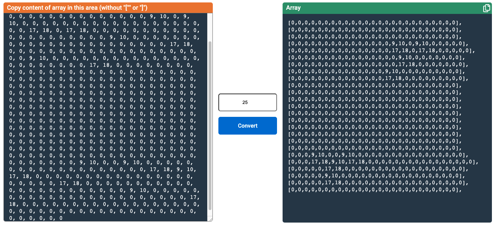
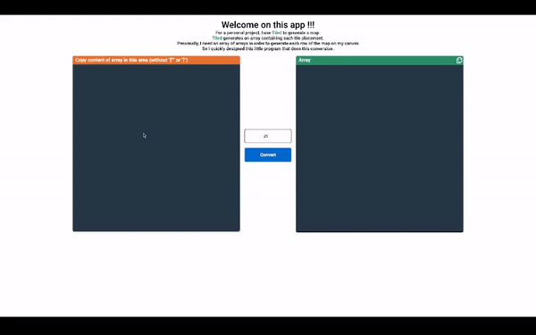

# convertJsonArray

For a personal project, I use Tiled to generate a map.

Tiled generates an array containing each tile placement.

Personally, I need an array of arrays in order to generate each row of the map on my canvas

So I quickly designed this little program that does this conversion.

### [link to app](https://jonathan-scapin.github.io/convertJsonArray/)